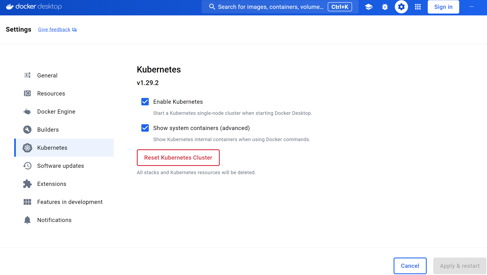

# k8s集群实战
1、安装docker desktop 并启用k8s：

#### 2、安装kuboard
安装命令：https://www.kuboard.cn/install/v3/install-built-in.html#%E9%83%A8%E7%BD%B2%E8%AE%A1%E5%88%92
~~~
docker run -d --restart=unless-stopped --name=kuboard -p 8089:80/tcp -p 10081:10081/tcp -e KUBOARD_ENDPOINT="http://10.85.37.189:8089" -e KUBOARD_AGENT_SERVER_TCP_PORT="10081" -v D:\kuboard_data:/data swr.cn-east-2.myhuaweicloud.com/kuboard/kuboard:v3
~~~

# k8s存活探针liveness probe
~~~
apiVersion: v1
kind: Pod
metadata:
  name: liveness-http
spec:
  containers:
  - name: liveness
    image: nginx:alpine
    livenessProbe:
      httpGet:
        path: /
        port: 80
      initialDelaySeconds: 10    # 容器启动后多久开始探测
      timeoutSeconds: 2          # 表示容器必须在2s内做出相应反馈给probe，否则视为探测失败
      periodSeconds: 30          # 探测周期，每30s探测一次
      successThreshold: 1        # 连续探测1次成功表示成功
      failureThreshold: 3        # 连续探测3次失败表示失败
~~~

