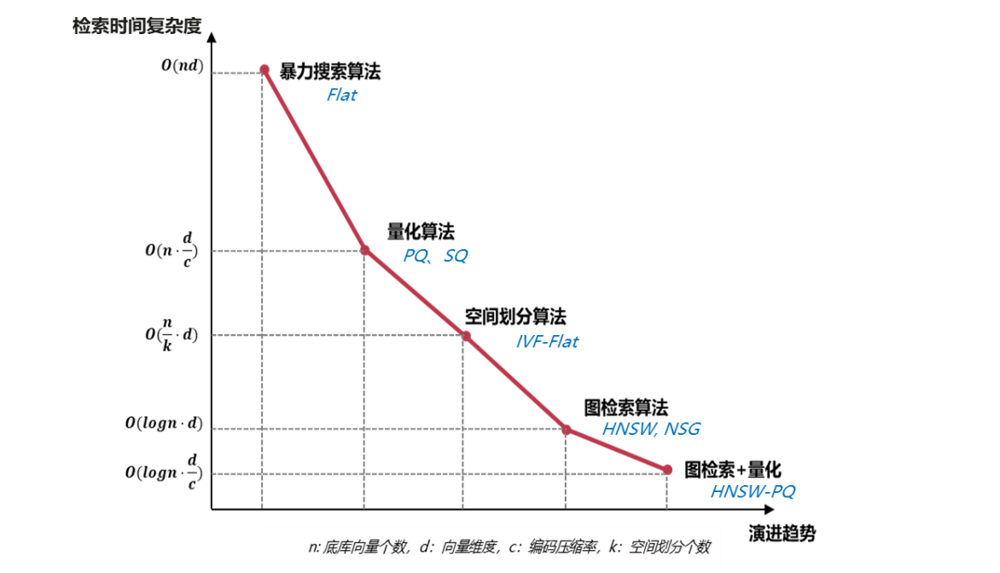
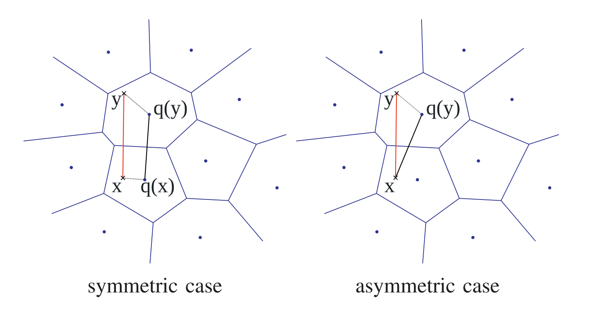
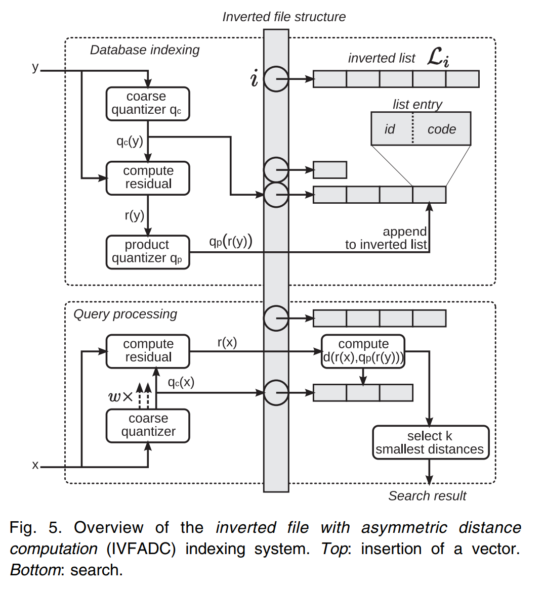
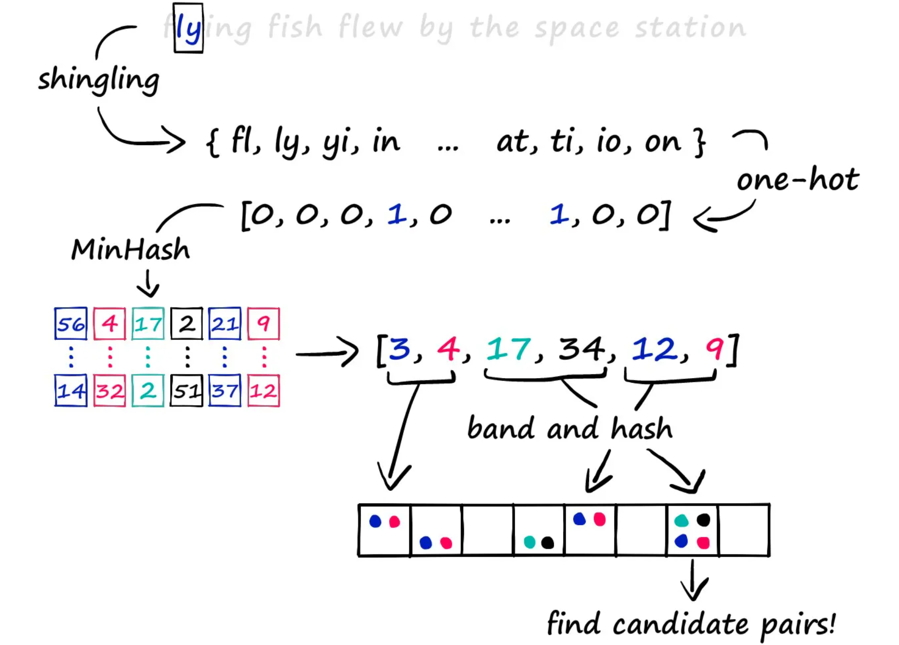

## 向量检索
向量检索当前有5条主流技术路线：暴力检索算法，量化算法，空间划分算法，图检索算法，图检索+量化融合算法
图检索算法是当前业界的SOTA算法，具有压倒性性能优势，劣势是内存开销大，索引构建耗时长

## HNSW算法
参考链接：https://luxiangdong.com/2023/11/06/hnsw/

## PQ算法
PQ即Product Quantization(内积量化)
听名字比较难懂，乘积其实是指通过将高维向量分解为较小的子向量，去代为表征整个向量空间，用以减少存储和计算量
Quantization：量化在信息论里一个比较简单的场景，比如将连续信号转化为数字信号(通过采样得到离散值)，在这个向量索引的算法里，也是这个意思  
将子向量空间中的多个离散的点，用一个中心点centroids来表示，计算距离时，也通过这个中心点来计算距离，计算量也同样会变少

检索距离计算有两种方式：  
SDC: 先将查询向量也进行量化，然后计算量化subvector间的距离
ADC: 不需要将查询向量量化，直接计算subvector和量化subvector的距离

名词概念解释了，那我们来看下PQ算法整体的设计思路：
~~~
1. 假定现在有向量X,D维，通过量化器q_j分解到m个子向量组u_j，每个子向量维度表示为D*，数据集大小为n,每组进行Kmeans聚类算法，每组的聚类数量表示为k*
此时，我们得到 [m x k*]个 D* 维度的centre点([m, k*, D*])，定义为Codebook: c_ji表示其中一个code，维度D*,其中j<=m, i<=k*
2. 有了c_ji这个codebook后，将X全部量化为centroids的矩阵，并发计算u_ji的nearest的c_ji  
将c_ji的索引赋值到id_b，得到id_b[n, m]，其value值的范围是0-mxk*
3. 搜索阶段：xq通过q_j生成子向量q(xq)_j  
  采用SDC方案，则需要先将各c_j下的的两两之间的距离计算出来，然后计算各q(xq)_j距离最近的cq_j，然后比较cq_j和所有id_b的距离。  
  比如：cq_0...cq_m compare id_b[1, m],m个距离再求和得到最终距离，然后比较n行中的topk
  采用ADC方案，不需要计算两两距离，需要先将q(xq)_j和c_ji的距离全部计算出来dis_ji，然后再根据dis_ji比较cq_j和id_b中的索引获取距离，每行的数据求和，比较n行中的TopK
~~~
由于PQ算法要计算是exhaustive search，所以作者又结合了IVF,提出了IVFADC算法

设计逻辑：
1. 给定的数据集是y，定义一个coarse quantizer qc(kmeans算法)，得到的centroids qc(y)
2. 计算残差r(y) = y - qc(y)
3. 对残差进行乘积量化，得到qp(r(y))
4. 将每个向量y的index，以及这个向量乘积量化后的code，加入qc(y)的invertedlist
5. 给定搜索向量x，通过qc量化到w个最近邻 w属于 qc(y)，计算残差r(x) = x - qc(y)
6. 计算残差uj(rx)和每个c_ji的距离(这里的c_ji中的i可以考虑不全遍历)
7. 计算rx到w个invertedlist中的向量的距离，通过索引获取第6步的结果，再求和，得到向量距离，排序得到TopK

参考链接：
https://blog.rexking6.top/2018/10/21/Product-Quantization%E4%B9%98%E7%A7%AF%E9%87%8F%E5%8C%96/
http://staff.ustc.edu.cn/~huding/data_pdf/Product%20Quantization.pdf
https://zhuanlan.zhihu.com/p/140548922
https://ieeexplore.ieee.org/stamp/stamp.jsp?tp=&arnumber=5432202&tag=1
https://nekoneko.best/StudyNotes/faiss_ivfpq.html

### PQ算法演进
PQ算法提出
Optimized Production Quantization: OPQ
Locally Optimized Product Quantization: LOPQ
可导Product Quantization:
参考链接：https://cloud.tencent.com/developer/article/2117143

#### 信息检索方向论文
https://cloud.tencent.com/developer/article/2117092

## LSH算法
参考链接：https://medium.com/dataman-in-ai/search-like-light-speed-2-lsh-b66c90349c66
LSH算法在解析text上有详细的描述，参考链接：https://www.pinecone.io/learn/series/faiss/locality-sensitive-hashing/

第一步：将所有的底库的text通过k-shingling算法生成sparse vector

        k-shingling的逻辑：
        1> 将text按照k个charactor分割，得到一个n个shingle的all_set，例如{"ab",..."dc"}
        2> 将每个text按k-shingling分割后，按照是否在all_set中存在(存在置为1)，得到每个text的sparse_vectorx

第二步：通过一个/多个随机的minhash算法，对每一个text进行编码，形成dense vector；

    minhash算法编码逻辑：
        1> 生成m个[1, n]的数组，在进行shuffle打散，得到：hash_1,...,hash_m
        2> 依次遍历hash_1.index(1)-hash_1.index(n),...,hash_m.index(1)-hash_m.index(n)
           如果在hash_1的1,2,3,4所在的位置上碰到sparse_vector在此位上为1，则取出此值
        3> 最后形成一个m位的数组[x,...,x]即为dense vector
第三步：将所有的dense vector分成条带band，比如m=20，可以设置4个hash函数，每5位数据做一个hash
        
        1> 所有的向量通过hash函数，形成基于hash值的倒排索引
        2> 给定一个查询向量，编码得到dense vector，而后通过4个hash函数，计算hash值，hash值相同的bucket中的索引作为candidates
        3> 最后计算candidates和这个查询向量的距离，得到topK
LSH算法几个问题：
        1> 如何确定dense vector的相似度能代表 sparse vector？
        2> dense vector的第三步的hash算法如何选择？

## Faiss基础使用
参考链接：https://www.cnblogs.com/sug-sams/p/12607662.html
### IndexFlatL2索引
index flatl2属于faiss中的暴力检索，比较每个向量，得出想向量相似度排序，是所有的排序中的基准
#### 使用方法
~~~
import faiss # 引入faiss
d = sentence_embeddings.shape[1] # 向量底库numpy数组，获取列数即特征维度
index = faiss.IndexFlatL2(d) # 构建欧式距离索引
index.is_trained # 输出结果为true
index.add(sentence_embeddings) # 将向量底库加入索引中，即放入内存
k = 4
xq = model.encode(["Someone sprints with a football"]) # 构建查询向量
D, I = index.search(xq, k)  # search，xq为查询向量
~~~
参考链接：https://www.pinecone.io/learn/series/faiss/faiss-tutorial/

### HNSW算法
#### 1、参数
M: 每个节点连接的其他节点数量，连接数量不是越大越好
efConstruction：构建索引时搜索邻居节点的数量，数量越大，链接的合理性越高
efSearch：搜索时搜索的邻居数目，值越大精度越高

### HNSWPQ算法

## Faiss：The missing Manual
介绍faiss的使用的博客：https://www.pinecone.io/learn/series/faiss/faiss-tutorial/

## Annoy算法
https://zr9558.com/2022/01/04/annoy/
https://www.qin.news/nndescent/
https://leileiluoluo.com/posts/kdtree-algorithm-and-implementation.html
https://blog.yucheng.me/post/kd-tree/
https://www.cnblogs.com/eyeszjwang/articles/2429382.html

## ANN benchmarks
https://erikbern.com/2018/06/17/new-approximate-nearest-neighbor-benchmarks.html
https://ann-benchmarks.com/nytimes-256-angular_10_angular.html
https://ann-benchmarks.com/qsgngt.html

## ANN算法Github
nmslib/hnswlib: https://github.com/nmslib/hnswlib
yahoo/ngt: https://github.com/yahoojapan/NGT/blob/main/python/README.md
HWTL_SDU-ANNS: https://github.com/WPJiang/HWTL_SDU-ANNS

## 其他参考
Faiss API：https://faiss.ai/cpp_api/struct/structfaiss_1_1IndexIVFPQFastScan.html

IVFPQFS Issue：https://github.com/facebookresearch/faiss/issues/2199
Faiss Summary of methods：https://github.com/facebookresearch/faiss/wiki/Faiss-indexes/1f721de164ae7950c65914d2dde0865312584a36
Bruch, Sebastian. Foundations of Vector Retrieval. Springer, 2024：https://link.springer.com/book/10.1007/978-3-031-55182-6
Wang, Mengzhao, et al. "A comprehensive survey and experimental comparison of graphbased approximate nearest neighbor search." arXiv preprint arXiv:2101.12631 (2021).
https://arxiv.org/abs/2101.12631
华为昇腾向量检索算法库：https://www.hiascend.com/document/detail/zh/mindsdk/60rc1/mxIndex/mxindexfrug/mxindexfrug_0005.html
其他总结：file:///C:/Users/g00840027/Downloads/vectorstore.pdf
向量数据库的选型加算法基础：https://guangzhengli.com/blog/zh/vector-database/
