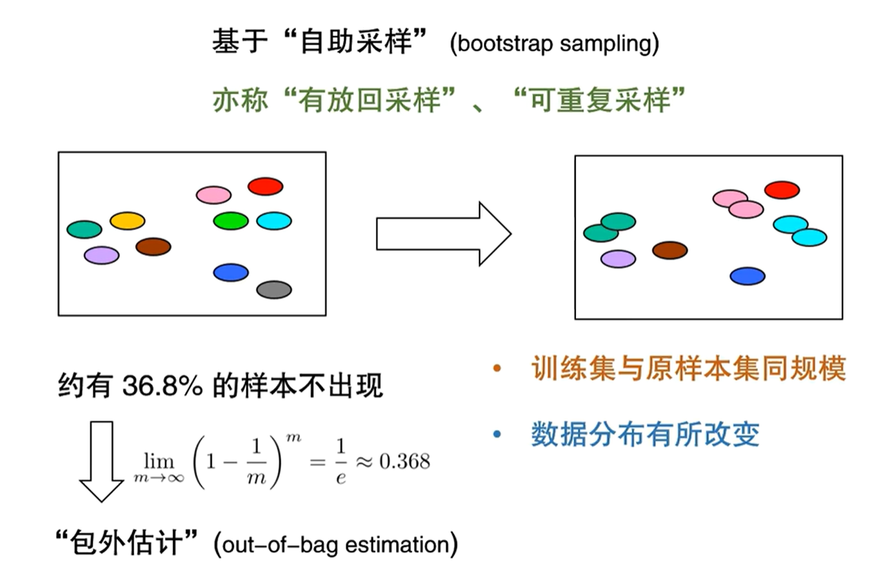

### 过拟合和欠拟合概念
过拟合：误以为有锯齿的为树叶，碰到一个没有锯齿的树叶，判定为非树叶，则称为过拟合
欠拟合：误以为绿色的都是树叶，碰到绿色的树，也认为是树叶，则称为欠拟合

### 机器学习的关键问题
1、评估方法：如何获得测试结果
2、性能度量：如何评估性能优劣
3、比较检验：如何判断实质差别

#### 评估方法
留出法：数据级分割为训练集和测试集。
    注意：训练集和测试集分布一致；
k-fold法：数据
bootstrap sampling：自助采样

#### 性能度量
性能度量衡量模型的泛化能力的评价标准，反映了任务需求

### 线性回归
数据离散化需要注意下图的方式：如果数据有序则可以进行连续化，如果数据无序，则转化为k维向量

