# 关系总览

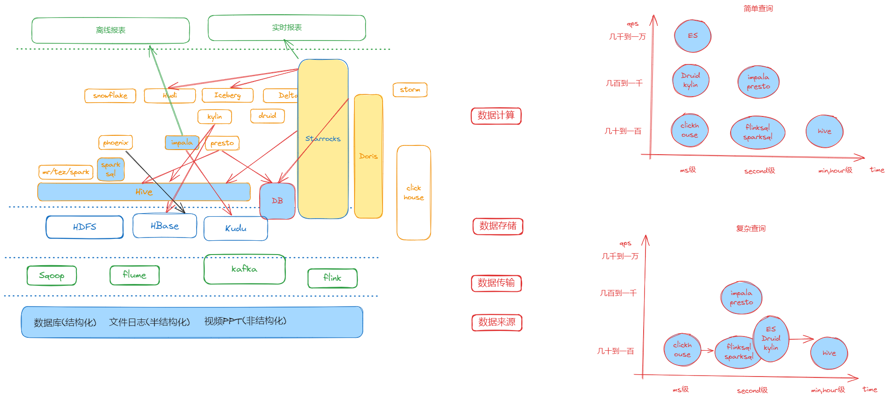

## 查询范围最小化

## 索引失效
### 联合索引，查询条件不满足最左匹配
~~~
KEY `union_idx` (`id_no`,`username`,`age`)
explain select * from t_user where id_no = '1002' and age = 12;
~~~
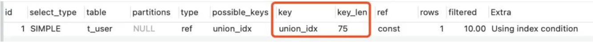

### 尽量不适用select *，匹配覆盖索引
~~~
explain select id_no, username, age from t_user where username = 'Tom2';
explain select id_no, username, age from t_user where age = 12;
~~~
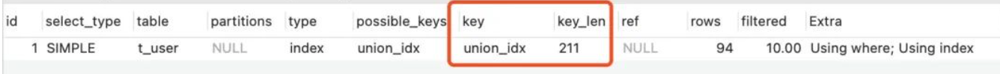

### 索引列勿参与运算
~~~
explain select * from t_user where id + 1 = 2 ;
~~~
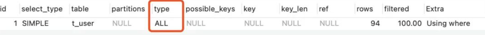
索引列参与运算，会导致全表扫描，索引失效，可以先通过内存计算，来让语句直接等于某个值，不再参与计算

### 索引列参与函数
~~~
explain select * from t_user where SUBSTR(id_no,1,3) = '100';
~~~
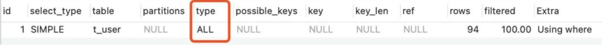
### 模糊查询语句占位符位于条件首部
~~~
explain select * from t_user where id_no like '%00%';
~~~
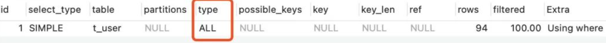

### 类型隐式转换
~~~
explain select * from t_user where id_no = 1002;
~~~
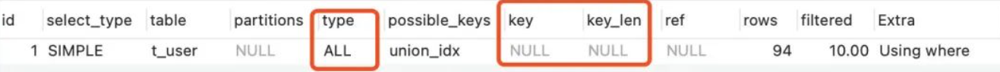
id_no为varchar类型的字符串，1002写入数值类型，走全表扫描
### 使用or时，注意两边都要有索引
~~~
explain select * from t_user where id = 2 or username = 'Tom2';
~~~
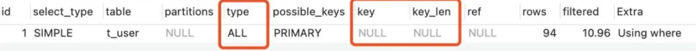
or语句，如果有一边没有索引，就不会走索引
~~~
explain select * from t_user where id  > 1 or id  < 80;
~~~
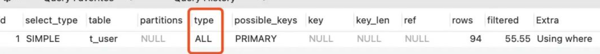
两边范围也不会走索引

### 两列做比较
~~~
explain select * from t_user where id > age;
~~~
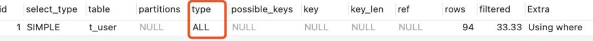
两列做比较，索引失效

### 查询条件使用不等进行比较时，需要慎重，普通索引会查询结果集占比较大时索引会失效
~~~
explain select * from t_user where id_no <> '1002';
~~~
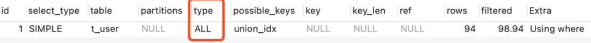
不走索引

~~~
explain select * from t_user where create_time != '2022-02-27 09:56:42';
~~~
上述SQL中，由于“2022-02-27 09:56:42”是存储过程在同一秒生成的，大量数据是这个时间。执行之后会发现，当查询结果集占比比较小时，会走索引，占比比较大时不会走索引。此处与结果集与总体的占比有关。

~~~
explain select * from t_user where id != 2;
~~~
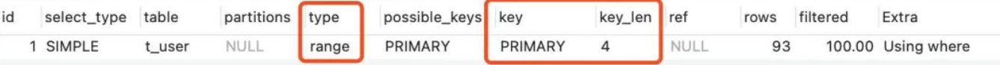
走索引

### 查询条件使用is null时正常走索引，使用is not null时，不走索引
~~~
explain select * from t_user where id_no is not null;
~~~
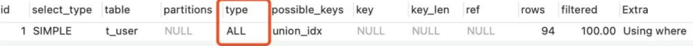

### 查询条件使用not in时，如果是主键则走索引，如果是普通索引，则索引失效；查询条件使用not exists时，索引失效
~~~
explain select * from t_user where id in (2,3);
explain select * from t_user where id_no in ('1001','1002');
explain select * from t_user u1 where exists (select 1 from t_user u2 where u2.id  = 2 and u2.id = u1.id);
explain select * from t_user where id_no between '1002' and '1003';
~~~
以上正常走索引
~~~
explain select * from t_user where id_no not in('1002' , '1003');
~~~
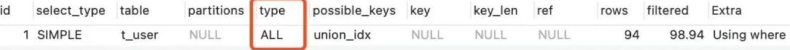
当使用not in时，不走索引?把条件列换成主键试试：
~~~
explain select * from t_user where id not in (2,3);
~~~
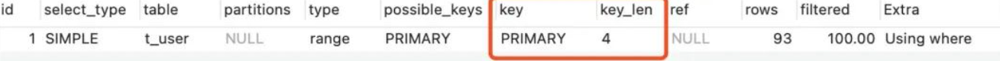
查询条件使用not in时，如果是主键则走索引，如果是普通索引，则索引失效。
再来看not exists：
~~~
explain select * from t_user u1 where not exists (select 1 from t_user u2 where u2.id  = 2 and u2.id = u1.id);
~~~
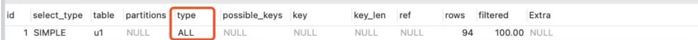
查询条件使用not exist，不走索引

### order by 导致索引失效
~~~
explain select * from t_user order by id_no ;
~~~
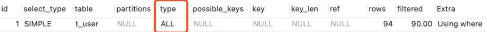
order by不走索引，添加limit也不走索引，但是如果是主键，则会走索引。经测试如果是覆盖索引场景，则可以正常走索引

### 当查询条件为大于等于、in等范围查询时，根据查询结果占全表数据比例的不同，优化器有可能会放弃索引，进行全表扫描
~~~
explain select * from t_user where create_time > '2023-02-24 09:04:23';
~~~
时间是未来时间，正常走索引：
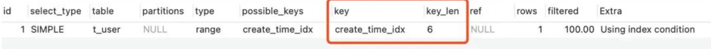
换个时间：
~~~
explain select * from t_user where create_time > '2022-02-27 09:04:23';
~~~
结果进行全表扫描：
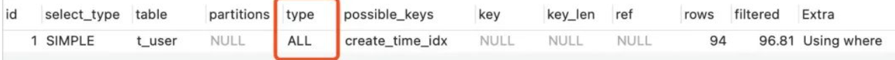
当查询条件为大于等于、in等范围查询时，根据查询结果占全表数据比例的不同，优化器有可能会放弃索引，进行全表扫描。

