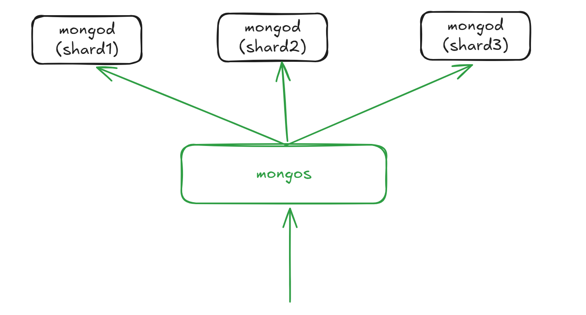

# Mongo基础知识
## Mongo分片

分片即Shard，适用于在有大量数据以及应对大量的数据写入和查询场景  
Mongo支持自动分片能力
~~~
启用分片命令
> sh.enableSharding("colletionName")
分片前选择分片的片键，片键要在索引上创建，所以要先添加索引
> db.users.ensureIndex({"username":1})
启用分片
> sh.shardCollection("test.users",{"username":1})
索引完成后，可以通过查看分片的状态
> sh.status()

---